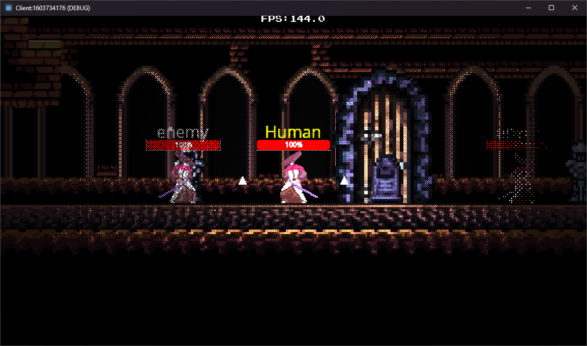
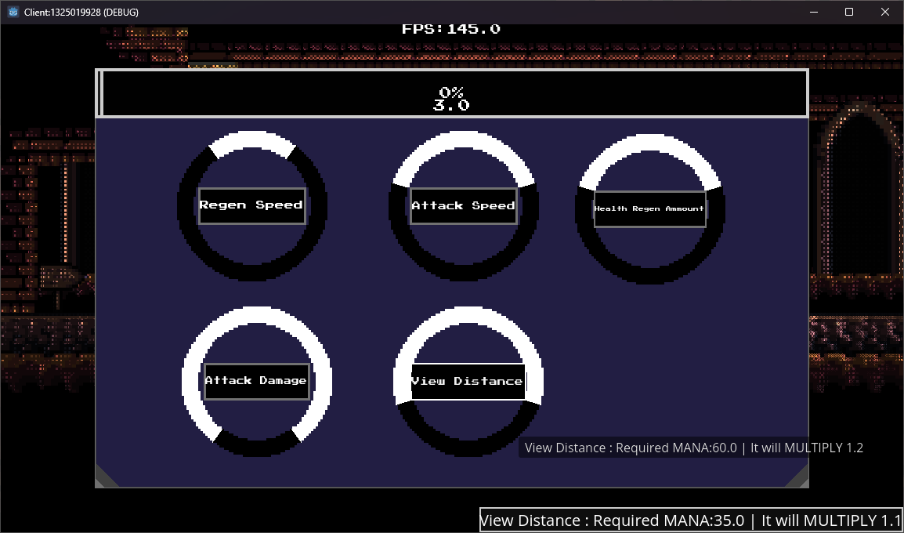
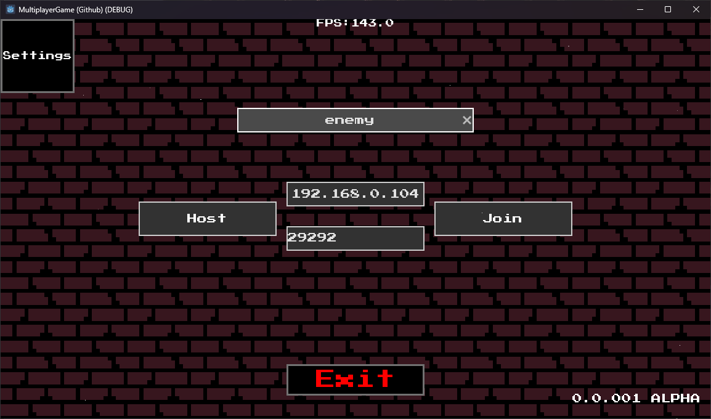

# Multiplayer 2D Action Game


**Multiplayer platformer / action game** developed in **Godot 4**. Features smooth player movement, combat system, upgrade mechanics, enemy AI, and real-time multiplayer support.

This project was created as a personal portfolio project to demonstrate proficiency in game development, networked gameplay, and clean architecture.

---

## 🎮 Features

- **Real-time Multiplayer** (using Godot's high-level multiplayer API)
- **Smooth** character controller with:
  - Run, Jump, Dash, Attack
  - Attack speed and movement upgrades
- **Custom Visiblity** based on lighting 
- **TileMap** based level design
- **Upgrade System** with visual feedback and UI
- **Audio Manager** with dynamic sound effects
- **Advanced Shaders**:
  - Dithering effect
  - Pixel Perfect lighting
- Pause menu, settings, and score system
- Clean, modular code structure

---

## 🛠 Technologies & Skills Demonstrated

- Godot 4 (GDScript)
- High-level Multiplayer (Enet, RPC, Sync)
- 2D Physics & Collision system
- Custom visibility system
- UI/UX design with Theme system
- Audio bus management
- Clean code architecture & scene organization
- Git & project versioning

---

## 🎯 Controls

| Action          | Keyboard     |
|----------------|--------------|
| Move            | A / D        |
| Jump            | Space        |
| Dash            | Shift        |
| Attack          | Left Mouse   |
| Pause           | Esc          |

*(Full controls can be seen in-game)*

---

## 📸 Screenshots






---

## 🚀 How to Run

1. Download or clone the repository
2. Open the project in **Godot 4.5+**
3. Run `Game.tscn` as the main scene
4. For multiplayer testing:
   - Run one instance as **Server**
   - Run other instances as **Client**

---
```
## 📁 Project Structure
MultiplayerGame/
├── Codes/           # All GDScript files (Player, Networking, UI, etc.)
├── Scenes/          # Main scenes (Game, Player, UI, etc.)
├── Sprites/         # Pixel art assets + normal maps
├── Audio/           # Sound effects
└── Build/           # Exported versions
```


## 🎓 Project Purpose

This project was developed to strengthen my game development skills, particularly in **networked multiplayer games**, shader programming, and polished gameplay feel. It serves as a strong demonstration of my ability to create complete, playable game systems from scratch.

I plan to continue developing this project by adding:
- Customizable characters
- Cleaner code
- Anti Cheat
- Custom Level Designer
- Mod Support
- More Settings
- Steam integration (future)

---

## 📬 Contact

**İlham**  
Aspiring Informatics
Applying to **Kaunas University of Technology** — Informatics

- GitHub: [TheMain](https://github.com/Hcode66)
- Email: [ilhamsemedov246@gmail.com]

---
